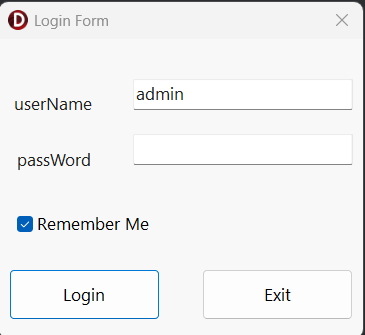

# Warehouse Management System

A professional warehouse management application built with:

- Delphi
- FireDAC
- Microsoft SQL Server

## Features

- Automatic database creation
- Database migration system
- Version controlled SQL scripts
- User authentication
- Role and permission structure
- Warehouse and product management foundation

## Architecture

The project uses a layered architecture:

- Core
- Database
- Security
- Services
- Forms

## Database Migration

Database changes are managed using versioned migration scripts.

Example:

VERSION:1
VERSION:2
VERSION:3

Each migration is executed only once and tracked by checksum.

## Requirements

- Delphi RAD Studio
- SQL Server 2022


## Project Structure

```text
WarehouseManagement
│
├── Core
│   └── Database
│       └── uDatabaseMigrator.pas
│
├── Data
│   ├── dmDatabase.pas
│   ├── uConnectionManager.pas
│   └── uDatabaseInitializer.pas
│
├── Database
│   └── Scripts
│       └── Upgrade.sql
│
├── Security
│   ├── uAuthenticationService.pas
│   ├── uPasswordHasher.pas
│   ├── uUserSeeder.pas
│   └── uUserSession.pas
│
├── Forms
│
├── README.md
└── LICENSE
```

## Development Status

Current Version: 0.1.0

Implemented:

- Automatic database creation
- SQL Server connection management using FireDAC
- Database migration engine
- Version-controlled SQL scripts
- Migration checksum validation
- User authentication foundation
- Role and permission database schema
- Warehouse and product database foundation

## Software Screenshots




In Progress:

- Login user interface
- User management
- Product management
- Inventory transactions
- Reporting system
```