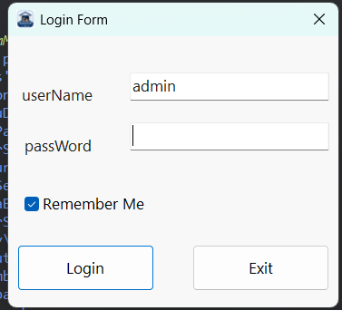

# Warehouse Management System

A modern and professional Warehouse Management System (WMS) built with **Delphi VCL**, **FireDAC**, and **Microsoft SQL Server**.

The project is designed using a clean, layered architecture with a strong focus on maintainability, scalability, and enterprise-level development practices.

---

# Features

## Database

- Automatic database initialization
- Automatic database creation
- SQL Server connection management
- Version-controlled database migration
- Automatic schema upgrades
- Database checksum validation
- Configuration via `Config.ini`

## Security

- Secure password hashing
- User authentication
- Remember Me functionality
- User session management
- Role-based authorization
- Permission management
- Default administrator seeding

## User Interface

- Modern Login Form
- Main Dashboard
- Embedded form navigation
- Dynamic form hosting
- Modular UI architecture

## Products Module

- Product database structure
- Product DataModule
- Product module foundation
- Ready for CRUD implementation

---

# Architecture

The application follows a layered architecture.

```
Presentation Layer
        │
        ▼
Application Layer
        │
        ▼
Business Layer
        │
        ▼
Data Access Layer
        │
        ▼
SQL Server
```

Project Layers

- Core
- Config
- Data
- Database
- Security
- Forms

---

# Database Migration

The project includes a custom migration engine.

Features

- Version-based migrations
- Automatic execution
- Executed only once
- SQL checksum validation
- Safe database upgrades

Example

```sql
/*<Version:1>*/
...
/*</Version:1>*/

/*<Version:2>*/
...
/*</Version:2>*/

/*<Version:3>*/
...
/*</Version:3>*/
```

---

# Requirements

- Delphi RAD Studio 12+
- Microsoft SQL Server 2022
- FireDAC
- Windows 10 / Windows 11

---

# Project Structure

```text
WarehouseManagement
│
├── Config
│   └── Config.ini
│
├── Core
│   ├── Database
│   │   └── uDatabaseMigrator.pas
│   │
│   ├── Forms
│   │   └── uFormHost.pas
│   │
│   └── UI
│
├── Data
│   ├── dmDatabase.pas
│   ├── dmProducts.pas
│   ├── uConnectionManager.pas
│   └── uDatabaseInitializer.pas
│
├── Database
│   └── Scripts
│       └── Upgrade.sql
│
├── Forms
│   ├── frmLogin.pas
│   ├── frmMain.pas
│   ├── frmDashboard.pas
│   ├── frmProducts.pas
│   └── frmProductEdit.pas
│
├── Security
│   ├── uAuthenticationService.pas
│   ├── uAuthorization.pas
│   ├── uPasswordHasher.pas
│   ├── uPermissionService.pas
│   ├── uRememberMe.pas
│   ├── uUserSeeder.pas
│   ├── uUserService.pas
│   └── uUserSession.pas
│
├── README.md
└── LICENSE
```

---

# Development Status

**Current Version**

```
0.1.0
```

## Completed

### Database

- Automatic database creation
- Connection manager
- FireDAC integration
- Database initializer
- Migration engine
- Version-controlled SQL scripts
- Checksum validation

### Security

- Password hashing
- Authentication service
- User session
- Remember Me
- Authorization
- Permission service
- Administrator seeding

### User Interface

- Login Form
- Main Application Window
- Dashboard
- Form Host
- Navigation framework

### Products

- Products database schema
- Products DataModule
- Products module foundation

---

## In Progress

- Product CRUD
- Product categories
- Units
- Inventory transactions
- Customer management
- Supplier management
- Warehouse management
- Reports
- User management
- Application settings

---

# Screenshots

## Login



---

# Roadmap

- Product Management
- Inventory Management
- Purchase Management
- Sales Management
- Customer Management
- Supplier Management
- Warehouse Transfers
- Barcode Support
- Reporting
- Dashboard Analytics
- User & Permission Management
- Backup & Restore
- Dark / Light Theme

---

# License

This project is licensed under the MIT License.